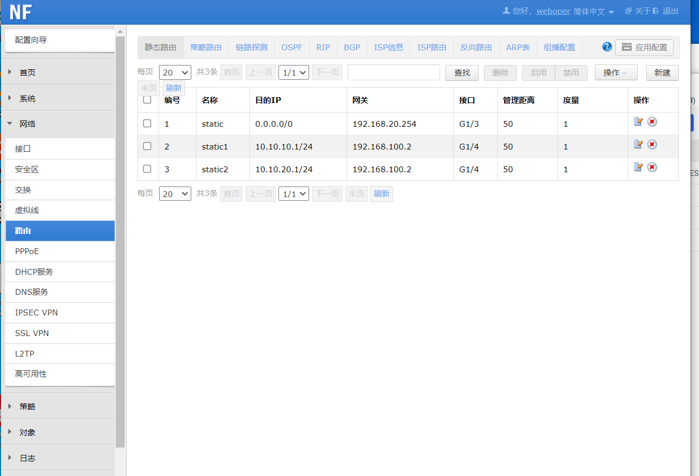

# 内网防火墙交换机设置实验
内网nat模拟外网环境

nat映射ip 192.168.20.155
## 绿盟防火墙
将自己的以太网网址修改为192.168.1.0/24
weboper
密码

https://192.168.1.1/


设置静态路由



## 华为交换机H3Cws5800设置
将自己的以太网网址修改为192.168.0.0/24

访问
http://192.168.0.233/

admin
admin


划分vlan100,10,20
分别对应ip192.168.100..2/24（连接防火墙接口）
10.10.10.1/24
10.10.20.1/24
默认网关为10.10.10.1和10.10.20.1


静态路由设置


命令配置步骤

创建VLAN 100，并将GigabitEthernet 1/0/1加入VLAN 100。

```
system-view
vlan 100
port gigabitethernet 1/0/1
quit` 


```

创建Vlan-interface 100，并配置其IP地址为192.168.1.1/24。

```
interface Vlan-interface 100
ip address 192.168.100.2 24
quit 

```
