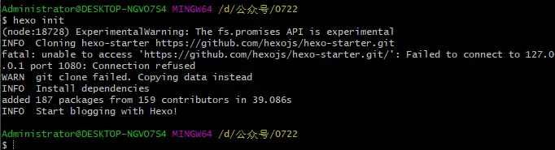
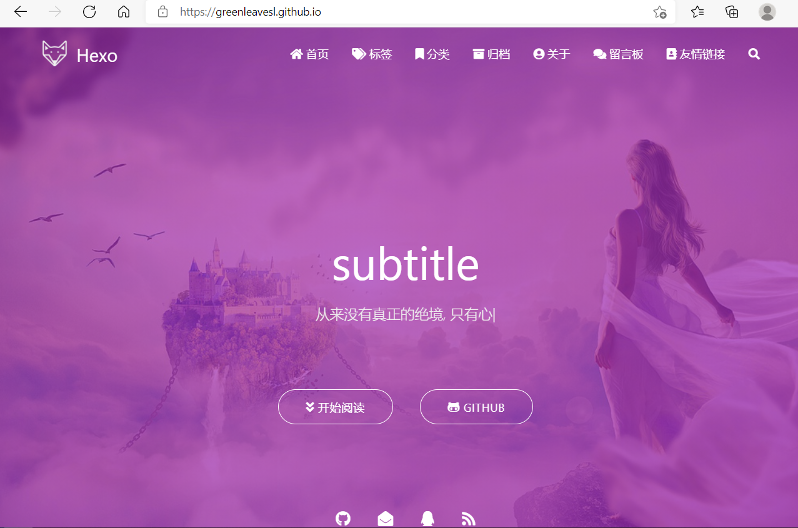
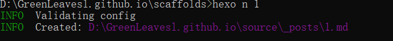

# 利用Hexo和github搭建博客（1）
利用git page搭建一个免费的博客
## 01环境准备
### windows
>1.安装git
>官方地址：https://git-scm.com/

1. git官方地址，下载对应的安装包，进行安装（简单的点击下一步）。

2. 安装好之后，鼠标右键可以看到：Git Bash Here，点击后打开了。

3. 输入：git --version


出现这个说明git安装成功。

>2. 安装node.js
>官方地址：https://nodejs.org/en/download/

1. 访问nodejs官方地址，下载对应的安装包，进行安装（简单的点击下一步）。

2. 安装好之后，配置环境变量，并在终端里面输入：node -v


出现这个说明nodejs安装成功~

>3.安装Hexo
>安装命令：npm install hexo -g
>


测试是否安装成功，命令：hexo -v


>4.安装hexo依赖
>命令：npm install --save hexo-deployer-git

### Linux
以ubuntu举例

```
apt-get update
apt-get install nodejs
apt-get install npm
apt install curl git vim
```
如果报错,请更改软件源--清华大学开源软件源,并更新

>nodejs -v
>npm -v

```
node.js版本过低就用nvm调整
nvm list
nvm install 对应版本
nvm ues 对应版本
```

hexo

创建目录
mkdir hexo
切换目录
cd hexo
全局安装 Hexo，需要最高权限，记得输入root密码
sudo npm install -g hexo-cli
初始化 Hexo
hexo init

npm install 


## 02git配置SSH key
SSH key 作用：
免密的将本地的源码和资源上传到github，无需要每次都输账号和密码。

先看本地是否配置好SSH key（命令：cd ~/.ssh）

因为ssh配置好之后是保存到 c:/用户/Administrator/.ssh

github与gitee操作基本一致

### 1.配置ssh

>先生成ssh key
>ssh-keygen -t rsa -C "邮件地址"
>备注：这里的邮件地址是github账号绑定的邮件地址

输入生成命令：ssh-keygen -t rsa -C "邮件地址"后。连续回车三次即可


可以看到在用户文件夹下生成了一个ssh文件夹


接着打开github主页，点击个人设置，点击左侧的SSH and GPG keys，点击New SSH key

将id_rsa.pub复制的内容粘贴到key中，title随便起一个就行。点击 Add SSH key

>测试是否成功：
>ssh -T git@github.com


配置账号和密码

$ git config --global user.name "XXX" #你的github用户名
$ git config --global user.email "xxx@163.com" #填写你的github注册邮箱

备注：用户名和邮箱记得改为 自己的


## 03 搭建个人博客
### 1.新建博客
开始之前先介绍一下heox的基本命令

```
hexo new "postName" #新建文章
hexo new page "pageName" #新建页面
hexo generate #生成静态页面至public目录
hexo server #开启预览访问端口（默认端口4000，'ctrl + c'关闭server）
hexo deploy #部署到GitHub
hexo help  # 查看帮助
hexo version  #查看Hexo的版本
```
>对应的缩写，比如：
>hexo n == hexo new
>hexo g == hexo generate

新建一个保存博客的存放目录，比如辰哥的是：D:\hexo
>进入到本地博客存放目录
>初始化 个人博客
>命令：hexo init
>

可以看到博客存放目录出现了如下内容：


>生成静态网页
>命令：hexo g
>预览
>命令：hexo s
>

>报错解决：
>
>问题：hexo g报错,line.mathALL is not funciton问题解决
>
>原因：nodejs版本低于12
>
>解决：两种方法
>
>方法1）请将nodejs升级到高于12.0.0的版本
>
>方法2）config.xml中的 highlight->enable的值从true更改为false，这样可以避免异常。
>
>在浏览器这访问：
>http://localhost:4000/


可以看到访问没问题。

但这个只是在本地预览，接着将这个博客部署到github。

### 2.部署到github/gitee
gitee可以参考github
新建一个github仓库


备注：最好是github的用户名


编辑_config.yml，_config.yml在博客存放目录下,实现github 与gitee同时推送

补充：github现在默认分支名为main，如果为了后期gitee和github双同步，可以在repository的setting中branches进行修改分支名

```
# Deployment
## Docs: https://hexo.io/docs/one-command-deployment
deploy:
  type: git
  repository: 
    github: git@github.com:username/username.github.io.git
    gitee: git@gitee.com:username/username.git
  branch: master
```
repository仓库地址改为自己的

branch看自己的github仓库是master还是main，辰哥这里是main，所以就填写main

>发布到github
>
>命令：hexo d

在浏览器访问
https://greenleavesl.github.io/


## 04 利用hexo-theme-matery美化hexo

下载 master 分支的最新稳定版的代码，解压缩后将 hexo-theme-matery 的文件夹重命名为matery，复制到Hexo 的 themes
可以在themes 文件夹下使用Git clone命令来下载：
`git clone https://github.com/blinkfox/hexo-theme-matery.git`

一些不需要或想开启的功能都可以在matery主题下的_config.yml中操作将其功能模块开启（true）或关闭(false)

### 切换主题
下载完后，将站点配置文件中的 theme 值修改为你下载主题的文件名


```
# Extensions
## Plugins: https://hexo.io/plugins/
## Themes: https://hexo.io/themes/
theme: matery
```

一些其他在站点目录配置：

language: zh-CN网站的语言设置

url: 网站的网站（域名）

per_page: 12建议修改为 6 的倍数，主题排版比较好


### 新建页面
#### 1.标签页
`hexo new page "tags"`
编辑新建的/source/tags/index.md文件
```
---
title: tags
date: 2020-02-23 19:37:07
type: "tags"
layout: "tags"
---
```
#### 2、分类页
`hexo new page "categories"`

编辑新建的/source/categories/index.md文件
```
---
title: categories
date: 2020-02-23 19:37:07
type: "categories"
layout: "categories"
---
```

#### 3、关于页面
`hexo new page "about"`

编辑新建的/source/about/index.md文件
```
---
title: about
date: 2020-02-23 19:37:07
type: "about"
layout: "about"
---
```

#### 4、留言板
hexo new page "contact"
编辑新建的/source/contact/index.md文件
```
---
title: contact
date: 2020-02-23 19:37:07
type: "contact"
layout: "contact"
---
```
#### 5、友情链接
`hexo new page "friends"`
编辑新建的/source/friends/index.md文件

```
---
title: friends
date: 2020-02-23 19:37:07
type: "friends"
layout: "friends"
---
```

然后在博客 source 目录下新建 _data 目录，在 _data 目录中新建 friends.json 文件，文件内容如下所示：

```
[
	{
	    "avatar": "https://cdn.jsdelivr.net/gh/GreenLeavesl/leaves_img/img/R-C.jpg",
	    "name": "Blog",
	    "introduction": "CSDN社区",
	    "url": "https://blog.csdn.net/hahakenihaoa",
	    "title": "CSDN"
	}, 
	{
	    "avatar": "https://cdn.jsdelivr.net/gh/GreenLeavesl/leaves_img/img/OIP-C%20(1).jpg",
	    "name": "github",
	    "introduction": "github",
	    "url": "https://github.com/GreenLeavesl",
	    "title": "github"
	}, 
	{
	    "avatar": "https://cdn.jsdelivr.net/gh/GreenLeavesl/leaves_img/img/OIP-C.jpg",
	    "name": "gitee",
	    "introduction": "leaves",
	    "url": "https://gitee.com/GreenLeavesl",
	    "title": "gitee"
	}
]
```
#### 6、添加 404 页面

首先再站点根目录下的 source 文件夹下新建 404.md 文件，里面内容如下：

```
---
title: 404
date: 2020-02-23 19:37:07
type: "404"
layout: "404"
description: "Oops～，我崩溃了！找不到你想要的页面了"
---
```

紧接着再新建主题文件夹的 layout 目录下新建 404.ejs 文件，添加内容如下：


```
<style type="text/css">
    /* don't remove. */
    .about-cover {
        height: 90.2vh;
    }
</style>
<div class="bg-cover pd-header about-cover">
    <div class="container">
        <div class="row">
            <div class="col s10 offset-s1 m8 offset-m2 l8 offset-l2">
                <div class="brand">
                    <div class="title center-align">
                        404
                    </div>
                    <div class="description center-align">
                        <%= page.description %>
                    </div>
                </div>
            </div>
        </div>
    </div>
</div>

<% if (theme.banner.enable) { %>
    <script>
        // 每天切换 banner 图.  Switch banner image every day.
        var bannerUrl = "<%- theme.jsDelivr.url %><%- url_for('/medias/banner/') %>" + new Date().getDay() + '.jpg';
        $('.bg-cover').css('background-image', 'url(' + bannerUrl + ')');
    </script>
<% } else { %>
    <script>
        $('.bg-cover').css('background-image', 'url(<%- theme.jsDelivr.url %><%- url_for('/medias/banner/0.jpg') %>)');
    </script>
<% } %>
```
#### 7、添加自定义页面
首先在站点目录下的 source 文件夹下新建 aboutme 文件，文件名可自定义，然后编写一个 index.html 放入 aboutme 文件夹下，然后在主题配置文件下的导航配置信息添加下面的配置：
```
About:
    url: /
    icon: fas fa-address-card
    children:
      - name: 关于我
        url: /about
        icon: fas fa-user-circle
      - name: Another    #这是新添加的，在原有配置基础上添加
        url: /aboutme
        icon: fa fa-user-secret
```

然后在站点配置文件下，找到 skip_render，在后面添加属性，如下：
```
# 其意思为在对文件进行渲染时跳过aboutme文件下的所有文件
skip_render: 
    - aboutme/** 
    - aaa/**
    - bbb/**
```

### 配置菜单导航
图标 icon 可以在 [Font Awesome](https://fontawesome.com/icons) 中查找
```
# main menu navigation url and icon
# 配置菜单导航的名称、路径和图标icon.
menu:
  Index:
    url: /
    icon: fas fa-home
  Tags:
    url: /tags
    icon: fas fa-tags
  Categories:
    url: /categories
    icon: fas fa-bookmark
  Archives:
    url: /archives
    icon: fas fa-archive
  About:
    url: /about
    icon: fas fa-user-circle
  Contact:
    url: /contact
    icon: fas fa-comments
  Friends:
    url: /friends
    icon: fas fa-address-book
```
### 添加 emoji 表情支持
需要安装插件 hexo-filter-github-emojis
`npm install hexo-filter-github-emojis --save`
在 Hexo 根目录下的 _config.yml 文件中，新增以下的配置项：

```
githubEmojis:
  enable: true
  className: github-emoji
  inject: true
  styles:
  customEmojis:
```
### 代码高亮
原本的代码显示行号和内容分开了，不美观
代码美化需要安装hexo-prism-plugin 插件

`npm i -S hexo-prism-plugin`
修改 Hexo 根目录下 _config.yml 文件中 highlight.enable 的值为 false，并新增 prism 插件相关的配置，主要配置如下：
```
highlight:			#代码块的设置
  enable: false			#开启代码块高亮
  line_number: true		#如果未指定语言，则启用自动检测
  auto_detect: false		#显示行数
  tab_replace: ''		#用n个空格替换tabs；如果值为空，则不会替换tabs
  wrap: ture
  hljs: false
# 关闭原有的代码高亮，使用自己的
prism_plugin:
  mode: 'preprocess'    # realtime/preprocess
  theme: 'tomorrow'
  line_number: false    # default false
  custom_css:
```
|---|---|
|参数KEY	|可选值|
|mode	|realtime (Parse code on browser in real time)|
|preprocess |(Preprocess code in node)|
|theme	|default <br>coy<br>dark<br>funky<br>okaidia<br>solarizedlight<br>tomorrow<br>twilight<br>如果要更多的选择访问： [hexo-prism-plugin](https://github.com/ele828/hexo-prism-plugin)|
|line_number |true (Show line numbers)<br>false (Default, Hide line numbers)|
|no_assets	|true (Stop loading asset files)<br>false (Default, load script and stylesheets files)|

注意：

hexo花括号显示失败的话，需要将hexo版本降级，改成hexo4.2.0版本就好了

卸载hexo5.0
npm uninstall hexo --save

安装4.2.0版本

npm install hexo@4.2.0 --save
### 主题的搜索功能
需要安装hexo-generator-search插件

`npm install hexo-generator-search --save`

在Hexo 根目录下的 _config.yml 文件中，新增以下的配置项：

```
search:
  path: search.xml
  field: post
```
### 文章字数统计插件
需要安装 hexo-wordcount 插件

`npm i --save hexo-wordcount`
主题下的 _config.yml 文件中，激活以下配置项即可：
```
wordCount:
  enable: false # 将这个值设置为 true 即可.
  postWordCount: true
  min2read: true
  totalCount: true
```

### 添加 RSS 订阅支持

需要安装hexo-generator-feed插件

npm install hexo-generator-feed --save
Hexo 根目录下的 _config.yml 文件中，新增以下的配置项：
```
feed:
  type: atom
  path: atom.xml
  limit: 20
  hub:
  content:
  content_limit: 140
  content_limit_delim: ' '
  order_by: -date
```
### 修改页脚
页脚信息可能需要做定制化修改，而且它不便于做成配置信息，所以可能需要你自己去再修改和加工。修改的地方在主题文件的 /layout/_partial/footer.ejs 文件中，包括站点、使用的主题、访问量等。

### 修改社交链接
在主题的 config.yml 文件中，默认支持 QQ、GitHub 和邮箱等的配置，你可以在主题文件的 /layout/_partial/social-link.ejs 文件中，新增、修改你需要的社交链接地址，增加链接可参考如下代码：


```
<% if (theme.socialLink.github) { %>
    <a href="<%= theme.socialLink.github %>" class="tooltipped" target="_blank" data-tooltip="访问我的GitHub" data-position="top" data-delay="50">
        <i class="fab fa-github"></i>
    </a>
<% } %>
```
### 修改打赏的二维码图片
在主题文件的 source/medias/reward 文件中修改

### 配置音乐播放器
支持接入第三方音乐，如 QQ 音乐，网易云音乐，酷狗音乐等等

主题的 _config.yml 配置文件中激活 music 配置即可：
```
# Whether to display the musics.
# 是否在首页显示音乐.
music:
  enable: true
  title: #非吸底模式有效
    enable: true
    show: 咕咕星的歌单
  autoHide: true    # hide automaticaly
  server: netease   #require	music platform: netease, tencent, kugou, xiami, baidu
  type: playlist    #require song, playlist, album, search, artist
  id: 2888085740     #require	song id / playlist id / album id / search keyword
  fixed: false       # 开启吸底模式
  autoplay: false   # 是否自动播放
  theme: '#42b983'
  loop: 'all'       # 音频循环播放, 可选值: 'all', 'one', 'none'
  order: 'random'   # 音频循环顺序, 可选值: 'list', 'random'
  preload: 'auto'   # 预加载，可选值: 'none', 'metadata', 'auto'
  volume: 0.7       # 默认音量，请注意播放器会记忆用户设置，用户手动设置音量后默认音量即失效
  listFolded: true  # 列表默认折叠
  hideLrc: true     # 隐藏歌词
```
>server 可选 netease（网易云音乐），tencent（QQ 音乐），kugou（酷狗音乐），xiami（虾米音乐），
>
>baidu（百度音乐）。
>
>type 可选 song（歌曲），playlist（歌单），album（专辑），search（搜索关键字），artist（歌手）
>
>id 获取示例：浏览器打开网易云音乐，点击我喜欢的音乐歌单，地址栏有一串数字，playlist 的 id 即为这串数字。

### 文章 Front-matter 介绍
| 配置选项      | 默认值                     | 描述                                                         |
| ------------- | -------------------------- | ------------------------------------------------------------ |
| title         | Markdown 的文件标题        | 文章标题，强烈建议填写此选项                                 |
| date          | 文件创建时的日期时间       | 发布时间，强烈建议填写此选项，且最好保证全局唯一             |
| author        | 根 _config.yml 中的 author | 文章作者                                                     |
| img           | featureImages 中的某个值   | 文章特征图，推荐使用图床                                     |
| top           | true                       | 推荐文章（文章是否置顶），如果 top 值为 true，则会作为首页推荐文章 |
| cover         | false                      | v1.0.2 版本新增，表示该文章是否需要加入到首页轮播封面中      |
| coverImg      | 无                         | v1.0.2 版本新增，表示该文章在首页轮播封面需要显示的图片路径，如果没有，则默认使用文章的特色图片 |
| password      | 无                         | 文章阅读密码，如果要对文章设置阅读验证密码的话，就可以设置 password 的值，该值必须是用 SHA256 加密后的密码，防止被他人识破。前提是在主题的 config.yml 中激活了 verifyPassword 选项 |
| toc           | true                       | 是否开启 TOC，可以针对某篇文章单独关闭 TOC 的功能。前提是在主题的 config.yml 中激活了 toc 选项 |
| mathjax       | false                      | 是否开启数学公式支持 ，本文章是否开启 mathjax，且需要在主题的 _config.yml 文件中也需要开启才行 |
| summary       | 无                         | 文章摘要，自定义的文章摘要内容，如果这个属性有值，文章卡片摘要就显示这段文字，否则程序会自动截取文章的部分内容作为摘要 |
| categories    | 无                         | 文章分类，本主题的分类表示宏观上大的分类，只建议一篇文章一个分类 |
| tags          | 无                         | 文章标签，一篇文章可以多个标签                               |
| reprintPolicy | cc_by                      | 文章转载规则， 可以是 cc\_by, cc\_by\_nd, cc\_by\_sa, cc\_by\_nc, cc\_by\_nc\_nd, cc\_by\_nc_sa, cc0, noreprint 或 pay 中的一个 |

> 注意:
>
> 1.  如果 img 属性不填写的话，文章特色图会根据文章标题的 hashcode 的值取余，然后选取主题中对应的特色图片，从而达到让所有文章都的特色图各有特色。
> 2.  date 的值尽量保证每篇文章是唯一的，因为本主题中 Gitalk 和 Gitment 识别 id 是通过 date 的值来作为唯一标识的。
> 3.  如果要对文章设置阅读验证密码的功能，不仅要在 Front-matter 中设置采用了 SHA256 加密的 password 的值，还需要在主题的 _config.yml 中激活了配置。有些在线的 SHA256 加密的地址，可供你使用：开源中国在线工具、chahuo、站长工具。
> 4.  您可以在文章 md 文件的 front-matter 中指定 reprintPolicy 来给单个文章

### 自定制修改
#### 修改主题颜色
```
在主题文件的 /source/css/matery.css 文件中修改
/* 整体背景颜色，包括导航、移动端的导航、页尾、标签页等的背景颜色. */
.bg-color {
    background-image: linear-gradient(to right, #2558FF 0%, #0f9d58 100%);
}
/*如果想去掉banner图的颜色渐变效果，请将以下的css属性注释掉或者删除掉即可*/
@-webkit-keyframes rainbow {
   /* 动态切换背景颜色. */
}
@keyframes rainbow {
    /* 动态切换背景颜色. */
}
```

#### 修改 banner 图和文章特色图
在 /source/medias/banner 文件夹中更换你喜欢的 banner 图片，主题代码中是每天动态切换一张，只需 7 张即可。如果你会 JavaScript 代码，可以修改成你自己喜欢切换逻辑，如：随机切换等，banner 切换的代码位置在 /layout/_partial/bg-cover-content.ejs 文件的 代码中：
```
$('.bg-cover').css('background-image', 'url(/medias/banner/' + new Date().getDay() + '.jpg)');
```
在 /source/medias/featureimages 文件夹中默认有 24 张特色图片，你可以再增加或者减少，并需要在 _config.yml 做同步修改。

如果想改为每小时或者每分钟切换 banner 图的话，需要将 getDay() 改为 getHours() 或者 getMinutes() 即可。

####  修改网站相关信息
```
#这是根目录下的配置文件信息
# Site
title: LeavesBlog		#网站标题
subtitle: '上下而求索' #网站副标题
description: 'keep hungry,keep foolish'	#网站描述description 主要用于5E0，告诉搜索引擎一个关于您站点的简单描述
keywords: [Linux，cybersecurity等]		#网站的关键词。使用半角逗号“，”分隔多个关键词
author: 咕咕星			#您的名字
language: zh-CN			#网站使用的语言。建议修改为zh-CN
timezone:			#网站时区。Hexo默认使用您电脑的时区。


# 这是主题配置文件的相关信息
# 配置网站favicon和网站LOGO
# 此处我用的CDN，也可以使用本地文件
favicon: https://cdn.jsdelivr.net/gh/guixinchn/image/blog/favicon.png
logo: https://cdn.jsdelivr.net/gh/guixinchn/image/blog/logo.png


# 网站副标题，打字效果
# 如果有符号 ‘ ，请在 ’ 前面加上 \
subtitle:
  enable: true
  loop: true # 是否循环
  showCursor: true # 是否显示光标
  startDelay: 300 # 开始延迟
  typeSpeed: 100 # 打字速度
  backSpeed: 50 # 删除速度
  sub1: 如果放弃太早，你永远都不知道自己会错过什么。
  sub2: 没有伞的孩子必须努力奔跑！
  sub3: 花开不是为了花落，而是为了开的更加灿烂。
  sub4: 没有礁石，就没有美丽的浪花；没有挫折，就没有壮丽的人生。
```
注意：

网站打字效果副标题默认有两个，即 sub1 和 sub2，如果想写多个，则需要修改两处地方，首先修改配置文件，如上面所示，在 sub1 和 sub2 后面继续添加即可，然后在去主题目录下的 layout 文件夹下的_partial 文件夹，修改 bg-cover-content.ejs 文件，大约在 12 行左右，如下面所示：
```
<div class="description center-align">
                <% if (theme.subtitle.enable) { %>
                <span id="subtitle"></span>
                <script src="https://cdn.jsdelivr.net/npm/typed.js@2.0.11"></script>
                <script>
                    var typed = new Typed("#subtitle", {
                        strings: ['<%= theme.subtitle.sub1 %>',
				 				  '<%= theme.subtitle.sub2 %>',
								  '<%= theme.subtitle.sub3 %>',
				 				  '<%= theme.subtitle.sub4 %>'],
                        startDelay: <%= theme.subtitle.startDelay %>,
                        typeSpeed: <%= theme.subtitle.typeSpeed %>,
                        loop: <%= theme.subtitle.loop %>,
                        backSpeed: <%= theme.subtitle.backSpeed %>,
                        showCursor: <%= theme.subtitle.showCursor %>
                    });
                </script>
                <% } else { %>
                    <%= config.description %>
                <% } %>
            </div>
```

#### 社交链接的修改
在主题的配置文件中修改
```
# The configurations of the second line of home banner
# icon/button will not show up if you leave the corresponding socialLink empty
# 首页 banner 中的第二行个人信息配置，留空即不启用
socialLink:
  github:  https://github.com/GreenLeavesl || github
  email: #1181062873@qq.com
  facebook: # https://www.facebook.com/xxx
  twitter: # https://twitter.com/xxx
  qq: #1181062873
  weibo: # https://weibo.com/xxx
  zhihu: # https://www.zhihu.com/xxx
  csdn: https://blog.csdn.net/hahakenihaoa || csdn
  rss: true # true、false
```
其中的 weixin 我是用的图片链接，会跳转到一个新的标签页，之后还需要修改 ejs 文件，文件在主题目录下的 layout 文件夹下的_partial 文件夹，修改 social-link.ejs，添加相关的配置，比如：
```
<% if (theme.socialLink.github) { %>
    <a href="<%= theme.socialLink.github %>" class="tooltipped" target="_blank" data-tooltip="访问我的GitHub" data-position="top" data-delay="50">
        <i class="fab fa-github"></i>
    </a>
<% } %>

<% if (theme.socialLink.email) { %>
    <a href="mailto:<%= theme.socialLink.email %>" class="tooltipped" target="_blank" data-tooltip="邮件联系我" data-position="top" data-delay="50">
        <i class="fas fa-envelope-open"></i>
    </a>
<% } %>

<% if (theme.socialLink.facebook) { %>
    <a href="<%= theme.socialLink.facebook %>" class="tooltipped" target="_blank" data-tooltip="关注我的Facebook: <%= theme.socialLink.facebook %>" data-position="top" data-delay="50">
        <i class="fab fa-facebook-f"></i>
    </a>
<% } %>

<% if (theme.socialLink.twitter) { %>
    <a href="<%= theme.socialLink.twitter %>" class="tooltipped" target="_blank" data-tooltip="关注我的Twitter: <%= theme.socialLink.twitter %>" data-position="top" data-delay="50">
        <i class="fab fa-twitter"></i>
    </a>
<% } %>

<% if (theme.socialLink.qq) { %>
    <a href="tencent://AddContact/?fromId=50&fromSubId=1&subcmd=all&uin=<%= theme.socialLink.qq %>" class="tooltipped" target="_blank" data-tooltip="QQ联系我: <%= theme.socialLink.qq %>" data-position="top" data-delay="50">
        <i class="fab fa-qq"></i>
    </a>
<% } %>

<% if (theme.socialLink.weibo) { %>
    <a href="<%= theme.socialLink.weibo %>" class="tooltipped" target="_blank" data-tooltip="关注我的微博: <%= theme.socialLink.weibo %>" data-position="top" data-delay="50">
        <i class="fab fa-weibo"></i>
    </a>
<% } %>

<% if (theme.socialLink.zhihu) { %>
    <a href="<%= theme.socialLink.zhihu %>" class="tooltipped" target="_blank" data-tooltip="关注我的知乎: <%= theme.socialLink.zhihu %>" data-position="top" data-delay="50">
        <i class="fab fa-zhihu1">知</i>
    </a>
<% } %>

<% if (theme.socialLink.rss) { %>
    <a href="<%- url_for('/atom.xml') %>" class="tooltipped" target="_blank" data-tooltip="RSS 订阅" data-position="top" data-delay="50">
        <i class="fas fa-rss"></i>
    </a>
<% } %>


<% if (theme.socialLink.jianshu) { %>
    <a href="<%= theme.socialLink.jianshu %>" class="tooltipped" target="_blank" data-tooltip="关注我的简书: <%= theme.socialLink.jianshu %>" data-position="top" data-delay="50">
        <i class="fab fa-jianshu">简</i>
    </a>
<% } %>

<% if (theme.socialLink.csdn) { %>
    <a href="<%= theme.socialLink.csdn %>" class="tooltipped" target="_blank" data-tooltip="关注我的CSDN: <%= theme.socialLink.csdn %>" data-position="top" data-delay="50">
        <i class="fab fa-csdn">C</i>
    </a>
<% } %>
<% if (theme.socialLink.juejin) { %>
    <a href="<%= theme.socialLink.juejin %>" class="tooltipped" target="_blank" data-tooltip="关注我的掘金: <%= theme.socialLink.juejin %>" data-position="top" data-delay="50">
        <i class="fab fa-juejin">掘</i>
    </a>
<% } %>

<% if (theme.socialLink.cnblogs) { %>
    <a href="<%= theme.socialLink.cnblogs %>" class="tooltipped" target="_blank" data-tooltip="关注我的博客园: <%= theme.socialLink.cnblogs %>" data-position="top" data-delay="50">
        <i class="fab fa-juejin">博</i>
    </a>
<% } %>
<% if (theme.socialLink.weixin) { %>
    <a href="<%= theme.socialLink.weixin %>" class="tooltipped" target="_blank" data-tooltip="微信联系我: <%= theme.socialLink.weixin %>" data-position="top" data-delay="50">
        <i class="fab fa-weixin"></i>
    </a>
<% } %>
```
### 其他一些个性DIY
#### 动态标题

实现方法，引入 js 文件，在主题文件下的 /source/js/ 下新建 FunnyTitle.js，增加以下代码
```
 var OriginTitle = document.title;
 var titleTime;
 document.addEventListener('visibilitychange', function () {
     if (document.hidden) {
         $('[rel="icon"]').attr('href', "https://cdn.jsdelivr.net/gh/guixinchn/image/blog/favicon.png");
         document.title = '我相信你还会回来的！';
         clearTimeout(titleTime);
     }
     else {
         $('[rel="icon"]').attr('href', "https://cdn.jsdelivr.net/gh/guixinchn/image/blog/favicon.png");
         document.title = '哈哈，我就知道！' + OriginTitle;
         titleTime = setTimeout(function () {
             document.title = OriginTitle;
         }, 2000);
     }
 });
```
然后在添加到 themes/matery/layout/layout.ejs 引入
`<script src="<%- theme.jsDelivr.url %><%- url_for('/js/FunnyTitle.js') %>"></script>`

### 关于我页面添加个人简历
打开 theme/matery/layout/about.ejs 文件，大约在 13 行。有一个 `` ` `` `` ` `` 标签，找出其对应结尾的标签，大约在 61 行左右，然后在新增如下代码：

```
<div class="card">
     <div class="card-content">
         <div class="card-content article-card-content">
             <div class="title center-align" data-aos="zoom-in-up">
                 <i class="fa fa-address-book"></i>&nbsp;&nbsp;<%- __('个人简历') %>
              </div>
                 <div id="articleContent" data-aos="fade-up">
                     <%- page.content %>
                 </div>
           </div>
      </div>
</div>
```
### 添加雪花飘落效果
实现方法：在themes/matery/source/libs/others下新建文件snow.js，并插入如下代码:（我用样式二）
```
/*样式一*/
(function($){
    $.fn.snow = function(options){
    var $flake = $('<div id="snowbox" />').css({'position': 'absolute','z-index':'9999', 'top': '-50px'}).html('&#10052;'),
    documentHeight  = $(document).height(),
    documentWidth   = $(document).width(),
    defaults = {
        minSize     : 10,
        maxSize     : 20,
        newOn       : 1000,
        flakeColor  : "#AFDAEF" /* 此处可以定义雪花颜色，若要白色可以改为#FFFFFF */
    },
    options = $.extend({}, defaults, options);
    var interval= setInterval( function(){
    var startPositionLeft = Math.random() * documentWidth - 100,
    startOpacity = 0.5 + Math.random(),
    sizeFlake = options.minSize + Math.random() * options.maxSize,
    endPositionTop = documentHeight - 200,
    endPositionLeft = startPositionLeft - 500 + Math.random() * 500,
    durationFall = documentHeight * 10 + Math.random() * 5000;
    $flake.clone().appendTo('body').css({
        left: startPositionLeft,
        opacity: startOpacity,
        'font-size': sizeFlake,
        color: options.flakeColor
    }).animate({
        top: endPositionTop,
        left: endPositionLeft,
        opacity: 0.2
    },durationFall,'linear',function(){
        $(this).remove()
    });
    }, options.newOn);
    };
})(jQuery);
$(function(){
    $.fn.snow({ 
        minSize: 5, /* 定义雪花最小尺寸 */
        maxSize: 50,/* 定义雪花最大尺寸 */
        newOn: 300  /* 定义密集程度，数字越小越密集 */
    });
});
/*样式二*/
/* 控制下雪 */
function snowFall(snow) {
    /* 可配置属性 */
    snow = snow || {};
    this.maxFlake = snow.maxFlake || 200;   /* 最多片数 */
    this.flakeSize = snow.flakeSize || 10;  /* 雪花形状 */
    this.fallSpeed = snow.fallSpeed || 1;   /* 坠落速度 */
}
/* 兼容写法 */
requestAnimationFrame = window.requestAnimationFrame ||
    window.mozRequestAnimationFrame ||
    window.webkitRequestAnimationFrame ||
    window.msRequestAnimationFrame ||
    window.oRequestAnimationFrame ||
    function(callback) { setTimeout(callback, 1000 / 60); };

cancelAnimationFrame = window.cancelAnimationFrame ||
    window.mozCancelAnimationFrame ||
    window.webkitCancelAnimationFrame ||
    window.msCancelAnimationFrame ||
    window.oCancelAnimationFrame;
/* 开始下雪 */
snowFall.prototype.start = function(){
    /* 创建画布 */
    snowCanvas.apply(this);
    /* 创建雪花形状 */
    createFlakes.apply(this);
    /* 画雪 */
    drawSnow.apply(this)
}
/* 创建画布 */
function snowCanvas() {
    /* 添加Dom结点 */
    var snowcanvas = document.createElement("canvas");
    snowcanvas.id = "snowfall";
    snowcanvas.width = window.innerWidth;
    snowcanvas.height = document.body.clientHeight;
    snowcanvas.setAttribute("style", "position:absolute; top: 0; left: 0; z-index: 1; pointer-events: none;");
    document.getElementsByTagName("body")[0].appendChild(snowcanvas);
    this.canvas = snowcanvas;
    this.ctx = snowcanvas.getContext("2d");
    /* 窗口大小改变的处理 */
    window.onresize = function() {
        snowcanvas.width = window.innerWidth;
        /* snowcanvas.height = window.innerHeight */
    }
}
/* 雪运动对象 */
function flakeMove(canvasWidth, canvasHeight, flakeSize, fallSpeed) {
    this.x = Math.floor(Math.random() * canvasWidth);   /* x坐标 */
    this.y = Math.floor(Math.random() * canvasHeight);  /* y坐标 */
    this.size = Math.random() * flakeSize + 2;          /* 形状 */
    this.maxSize = flakeSize;                           /* 最大形状 */
    this.speed = Math.random() * 1 + fallSpeed;         /* 坠落速度 */
    this.fallSpeed = fallSpeed;                         /* 坠落速度 */
    this.velY = this.speed;                             /* Y方向速度 */
    this.velX = 0;                                      /* X方向速度 */
    this.stepSize = Math.random() / 30;                 /* 步长 */
    this.step = 0                                       /* 步数 */
}
flakeMove.prototype.update = function() {
    var x = this.x,
        y = this.y;
    /* 左右摆动(余弦) */
    this.velX *= 0.98;
    if (this.velY <= this.speed) {
        this.velY = this.speed
    }
    this.velX += Math.cos(this.step += .05) * this.stepSize;

    this.y += this.velY;
    this.x += this.velX;
    /* 飞出边界的处理 */
    if (this.x >= canvas.width || this.x <= 0 || this.y >= canvas.height || this.y <= 0) {
        this.reset(canvas.width, canvas.height)
    }
};
/* 飞出边界-放置最顶端继续坠落 */
flakeMove.prototype.reset = function(width, height) {
    this.x = Math.floor(Math.random() * width);
    this.y = 0;
    this.size = Math.random() * this.maxSize + 2;
    this.speed = Math.random() * 1 + this.fallSpeed;
    this.velY = this.speed;
    this.velX = 0;
};
// 渲染雪花-随机形状（此处可修改雪花颜色！！！）
flakeMove.prototype.render = function(ctx) {
    var snowFlake = ctx.createRadialGradient(this.x, this.y, 0, this.x, this.y, this.size);
    snowFlake.addColorStop(0, "rgba(255, 255, 255, 0.9)");  /* 此处是雪花颜色，默认是白色 */
    snowFlake.addColorStop(.5, "rgba(255, 255, 255, 0.5)"); /* 若要改为其他颜色，请自行查 */
    snowFlake.addColorStop(1, "rgba(255, 255, 255, 0)");    /* 找16进制的RGB 颜色代码。 */
    ctx.save();
    ctx.fillStyle = snowFlake;
    ctx.beginPath();
    ctx.arc(this.x, this.y, this.size, 0, Math.PI * 2);
    ctx.fill();
    ctx.restore();
};
/* 创建雪花-定义形状 */
function createFlakes() {
    var maxFlake = this.maxFlake,
        flakes = this.flakes = [],
        canvas = this.canvas;
    for (var i = 0; i < maxFlake; i++) {
        flakes.push(new flakeMove(canvas.width, canvas.height, this.flakeSize, this.fallSpeed))
    }
}
/* 画雪 */
function drawSnow() {
    var maxFlake = this.maxFlake,
        flakes = this.flakes;
    ctx = this.ctx, canvas = this.canvas, that = this;
    /* 清空雪花 */
    ctx.clearRect(0, 0, canvas.width, canvas.height);
    for (var e = 0; e < maxFlake; e++) {
        flakes[e].update();
        flakes[e].render(ctx);
    }
    /*  一帧一帧的画 */
    this.loop = requestAnimationFrame(function() {
        drawSnow.apply(that);
    });
}
/* 调用及控制方法 */
var snow = new snowFall({maxFlake:60});
snow.start();
```

然后在themes/_config里libs.js.下面添加一行：

`snow: /libs/others/snow.js`

然后在 \themes\hexo-theme-hiero\layout\layout.ejs 文件里引用即可：
```
<!-- 雪花特效 -->
<script type="text/javascript" src="\js\snow.js"></script>
```

最后在themes/_config添加：

```
# 雪花特效
snow:
  enable: true
```


### 添加动漫人物挂件
方法：

1. 获取模型：

npm install --save hexo-helper-live2d
2. 安装喜欢的模型：

npm install packagename
将packagename换成模型名字：

npm install  live2d-widget-model-hibiki

模型预览：[live2d-widget-models](https://link.zhihu.com/?target=https%3A//github.com/xiazeyu/live2d-widget-models) GitHub项目地址：[hexo-helper-live2d](https://link.zhihu.com/?target=https%3A//github.com/EYHN/hexo-helper-live2d)

3. 然后打开博客根目录下的 _config.yml文件，添加如下代码：

方案一：
```
live2d:
      enable: true
      scriptFrom: local
      model:
        use: live2d-widget-model-hibiki #模型选择
      display:
        position: right  #模型位置
        width: 150   #模型宽度
        height: 300  #模型高度
      mobile:
        show: false  #是否在手机端显示
```

方案二：
```
live2d:
  enable: true
  scriptFrom: local
  pluginRootPath: live2dw/
  pluginJsPath: lib/
  pluginModelPath: assets/
  tagMode: false
  debug: false
  model:
    use: live2d-widget-model-hibiki
  display:
    position: right
    width: 150
    height: 300
  mobile:
    show: true
```

### 浏览器网页标题
1. 在 \themes\matery\source\js 下新建一个 FunnyTitle.js 文件，填写如下代码：

```
// 浏览器搞笑标题
var OriginTitle = document.title;
var titleTime;
document.addEventListener('visibilitychange', function () {
    if (document.hidden) {
        $('[rel="icon"]').attr('href', "/funny.ico");
        document.title = '╭(°A°`)╮ 页面崩溃啦 ~';
        clearTimeout(titleTime);
    }
    else {
        $('[rel="icon"]').attr('href', "/favicon.ico");
        document.title = '(ฅ>ω<*ฅ) 噫又好啦 ~' + OriginTitle;
        titleTime = setTimeout(function () {
            document.title = OriginTitle;
        }, 2000);
    }
});
```
2. 在 \themes\matery\layout\layout.ejs 文件中添加如下代码：

```
<!--浏览器搞笑标题-->
<script type="text/javascript" src="/js/FunnyTitle.js"></script>
```

###  添加动态线条
>会根据鼠标点击自动汇聚为一个圆

使用方法在 ：/Hexo/themes/matery/layout/layout.ejs文件中body前添加如下代码：
```
<!--动态线条背景-->
<script type="text/javascript"
color="220,220,220" opacity='0.7' zIndex="-2" count="200" src="//cdn.bootcss.com/canvas-nest.js/1.0.0/canvas-nest.min.js">
</script>
```
- color：表示线条颜色，三个数字分别为(R,G,B)，默认：（0,0,0）
- opacity：表示线条透明度（0~1），默认：0.5
- count：表示线条的总数量，默认：150
- zIndex：表示背景的z-index属性，css属性用于控制所在层的位置，默认：-1

### 博客名称溢出
解决办法：在matery.css中添加以下代码。不懂css的注意位置(第六行后面)

   ```
header .brand-logo .logo-img{
        display: none;
    }
   ```
### hexo博客出现无法加载“hexo-prism-plugin”
博客目录下的配置文件中打开，将以下代码放在最后即可
```
prism_plugin:
  mode: 'preprocess' # realtime/preprocess
  theme: 'default'
  line_number: false # default false
```
### linux后台运行Hexo
1. 安装pm2

`npm install -g pm2`

2. 在博客根目录写一个名为hexo_run.js的脚本
```
//run
const { exec } = require('child_process')
exec('hexo server',(error, stdout, stderr) => {
        if(error){
                console.log('exec error: ${error}')
                return
        }
        console.log('stdout: ${stdout}');
        console.log('stderr: ${stderr}');
})
```
3. 到博客根目录运行脚本
`pm2 start hexo_run.js`

```
pm2的相关命令
pm2 start hexo_run.js	#启动
pm2 list	#查看pm2管理的所有服务

pm2 stop all	#停止pm2列表的所有服务
pm2 stop 0 #停止进程为0的进程

pm2 reload all #重新载入列表所有进程
pm2 reload 0 #重载列表中进程为0的进程

pm2 restart all	#重启列表中所有的进程
pm2 restart 0	#重启列表中进程为0的进程

pm2 delete 0	#删除列表中进程为0的进程
pm2 delete all	#删除列表中所有的进程
```


## 05 利用git实现多地更新
- 利用github分支实现
- hexo生成的静态博客文件默认放在main(master)分支
- hexo的源文件（部署环境文件）可以都放在hexo分支上（可以新创建一个hexo分支），换新电脑时，直接git clone hexo分支

### hexo搭建博客原理
- hexo帮助把博客发送到github，同时把md文件转换成网页文件
- hexo目录下的文件和github上的文件是不

### 搭建hexo服务器端电脑设置
- 在Github的username.github.io仓库上新建一个xxx分支，并切换到该分支，并在该仓库->Settings->Branches->Default branch中将默认分支设为xxx，save保存；然后将该仓库克隆到本地，进入该username.github.io文件目录
`git clone -b hexo git@github.com:username/username.github.io.git`
完成上面步骤后，在当前目录使用Git Bash执行git branch命令查看当前所在分支，应为新建的分支xxx：

### 拷贝部署文件
- 如题，先将本地博客的部署文件（Hexo目录下的全部文件）全部拷贝进username.github.io文件目录中去。

接下来，进入username.github.io文件目录下，将该目录下的全部文件提交到xxx分支，提交之前需注意：

- 将themes目录以内中的主题的.git目录删除（如果有），因为一个git仓库中不能包含另一个git仓库，提交主题文件夹会失败。

- 可能有人会问，删除了themes目录中的.git不就不能git pull更新主题了吗，很简单，需要更新主题时在另一个地方git clone下来该主题的最新版本，然后将内容拷到当前主题目录即可。

### 提交hexo分支
- 执行git add .、git commit -m ‘back up hexo files’（引号内容可改）、git push即可将博客的hexo部署环境提交到GitHub个人仓库的xxx分支。

- 切换到username.github.io目录，执行npm install(由于仓库有一个.gitignore文件，里面默认是忽略掉 node_modules文件夹的，也就是说仓库的hexo分支并没有存储该目录[也不需要]，所以需要install下)

现在可以在GitHub上的username.github.io仓库看到两个分支的差异了。
master分支和xxx分支各自保存着一个版本，master分支用于保存博客静态资源，提供博客页面供人访问；xxx分支用于备份博客部署文件，供自己维护更新，两者在一个GitHub仓库内互不冲突。

- 执行hexo d -g指令（在此之前，有时可能需要执行hexo clean），完成后就会发现，最新改动已经更新到main(master)分支了，两个分支互不干扰
- 每次换电脑进行博客更新时，不管上次在其他电脑有没有更新，最好先git pull
- 然后将目录切换下username.github.io下，此时需要安装一下npm install， 最后执行hexo g、hexo s、hexo d等命令即可提交成功

## 06发布和删除博客
### 发布博客
#### 撰写文章
markdown编辑器（如：Typora、Vscode、Joplin、Vnote等）撰写博客
#### Hexo文章管理
1. 创建一个md文件
md文件也就是Markdown文件，通过以下命令来创建：

```
$ hexo new <title>
$ hexo new "我的第一篇文章"
```
2. 布局（layout）
创建md文件时，我们可以指定布局
```
$ hexo new [layout] <title>
$ hexo new page "我的页面"
```

布局有三种：post（文章）、draft（草稿）、page（页面）
在新建文件时，Hexo 会根据 scaffolds 文件夹内相对应的文件（可以理解为模板）来建立md文件：

- 如果没有指定布局类型，则为默认布局post，可以在站点配置文件修改 default_layout 参数来修改默认布局。
- 当我们创建不同布局的md文件时，它们会存储在不同路径：
post会在source下生成_post文件统一发布
draft会在source下生成_draft文件统一发布
page则是生成命名的文件并在里面生成一个index.md文件

3. 草稿（draft）
draft这种布局在建立时会被保存到 source/_drafts 文件夹中，但不会显示在页面上，如果我们不想某一篇文章显示在页面上，那么就可以把它移动到_drafts文件夹中。

我们可在启动服务器时加上 --draft 参数来查看草稿。
`$ hexo server --draft`

- 还可以在站点配置文件中把 render_drafts 参数设为 true 来预览草稿。
- 我们可以通过 publish 命令将草稿发布文章或者页面，它将会被移动到指定的文件夹。
`$ hexo publish [layout] <title>`
4. Front-matter
当我们创建一个md文件后，打开后会看到一些内容，这些称为Front-matter，它是文件最上方以 --- 分隔的区域，用于指定个别文件的变量，举例来说：

```
---
title: Hello World # 标题就是我们上面创建的时候指定的名字
date: 2013/7/13 20:46:25 # 文件创建的时间
---
```
在Typora中我们在md文件的首行（必须是第一行）输入--- ，然后按回车就可以插入Front-matter了。

**为文章添加分类与标签**
只有文章（post布局）支持分类和标签，需要在Front-matter中设置。分类有层级关系，标签没有。
```
categories:
- 个人博客（第一层级）
- Hexo博客（第二层级）
tags:
- Hexo
- 博客
```
**为文章添加多个分类**
```
categories:
- [日常, 生活]
- [日常, 随想]
- [日记]
```
一般发布文章或者修改博客后需要这些操作：清除缓存>生成静态文件>启动服务器，测试没问题后再部署。
```
$ hexo clean && hexo g && hexo s
$ hexo d
```

### 本地图片部署和展示问题
1. 安装插件
npm install https://github.com/7ym0n/hexo-asset-image --save

不要安装网上的npm install https://github.com/CodeFalling/hexo-asset-image --save


2. 配置
在 _config.yml 配置文件中修改 post_asset_folder 属性为 true


#### 图片引用
文件目录如下
```
|- _post  
|    |- _resource
|    |    |- hexo.png
|    |- article  
|    |    |- hexo.png  
|    |- article.md
```
1. 直接使用代码``（虽然没有写文件夹的名字，但是可以的），hexo.png 是我们存在 article 文件夹内的图片。这时你会发现markdown预览中无法显示这张图片，但是当你将博客上传到网站时，网站上是可以正常显示的。
2. 使用代码 不仅可以本地预览，上传到网站也可以正常显示。
3. 本地无法预览也是件很不舒服的事情，其实我们还可以另外创建一个文件夹 pictures ，里面专门存放所有文章的图片，代码  不仅可以本地预览，上传到网站也可以正常显示。


### 使用图床
使用 GitHub + PicGo + jsDelivr 搭建自己的私人图床
- Snipaste： win下用了几年的开源截图软件，非常强大
- Typora：常用Markdown编辑器
- Picgo：多图床整合工具
#### GitHub上创建一个存储库
添加一个存储库（New repositories）命名为：leaves_img，用于上传图片文件。


#### 使用PicGo客户端
1. 准备工作
（1）images存储库分支选master
在images存储库点击Settings:


分支选master branch

2. 配置token key


#### 配置PicGo
下载 PicGo
https://github.com/Molunerfinn/picgo/releases


- 设定仓库名：按照【用户名 / 图床仓库名】的格式填写
- 设定分支名：【 master 】
- 设定 Token：粘贴上述生成的【 Token 】
- 指定存储路径：填写想要储存的路径，如【 img/ 】，这样就会在仓库下创建一个名为 img 的文件夹，图片将会储存在此文件夹中
- 设定自定义域名：它的的作用是，在图片上传后，PicGo 会按照【 自定义域名 + 上传的图片名 】的方式生成访问链接，放到粘贴板上，因为我们要使用 jsDelivr 加速访问，所以可以设置为 https://cdn.jsdelivr.net/gh/用户名/图床仓库名

搭建完成上传

https://cdn.jsdelivr.net/gh/<你的github用户名>/<你的图床仓库名>@<仓库版本号>/图片的路径

``

#### Typora配置图片自动上传
确保版本号在 0.9.84 之后

选择图像。在上传服务，选择 PicGo(app)。PicGo路径，选择PicGo软件的安装路径。然后点击验证图片上传选项。上边的插入图片选择无特殊操作即可。

验证成功之后是下图这个样子，屏幕右下角也会有浮窗提示。

然后 PicGo 的相册中就多了两个此次测试的图片。

测试配置是否成功

上传成功后就是生成的图片连接


指定路径


### 删除博客
如果删除对应文章后，hexo clean && hexo g && hexo s和hexo d不起左右，则使用以下方法
```
第一步，去文件夹source/_posts下删除你想要删除的文章
第二步，删除.deploy_git文件夹
.deploy_git是git部署用的文件。当你为 git 部署选项运行hexo d命令时，Hexo 会创建一个名为.deploy_git的文件夹，并将生成的文件复制到该文件夹。
第三步，执行hexo clean后，再执行hexo g，hexo g 即可。
发现文章删除成功
```

## 排坑
1. 新建默认博客_post报yaml格式错误


删除后正常（如果标题中有空格，应用""号括起来，如hexo n "hello world"）


2. 如果github项目私有无法部署gitpage，请改回公开

在对应的repository的page设置为你hexo的_config.yml里设置的branch


补充：在_config中设置完全一致的repository的github/gitee项目名可以减少很多麻烦


**参考文章：**
https://blog.csdn.net/nightmare_dimple/article/details/86661514
https://cloud.tencent.com/developer/article/1046404
https://blog.csdn.net/qq_41684957/article/details/90680765
https://blog.csdn.net/qq_34243930/article/details/109046120
https://post.smzdm.com/p/alxd60g0/
